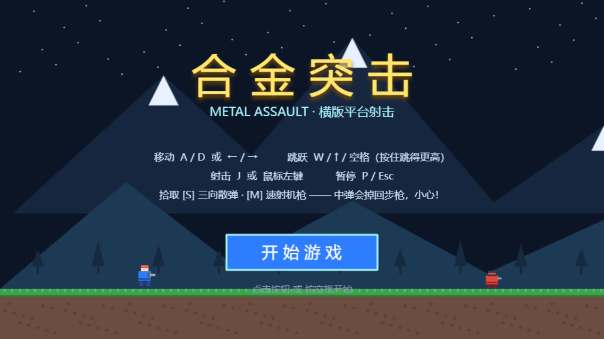
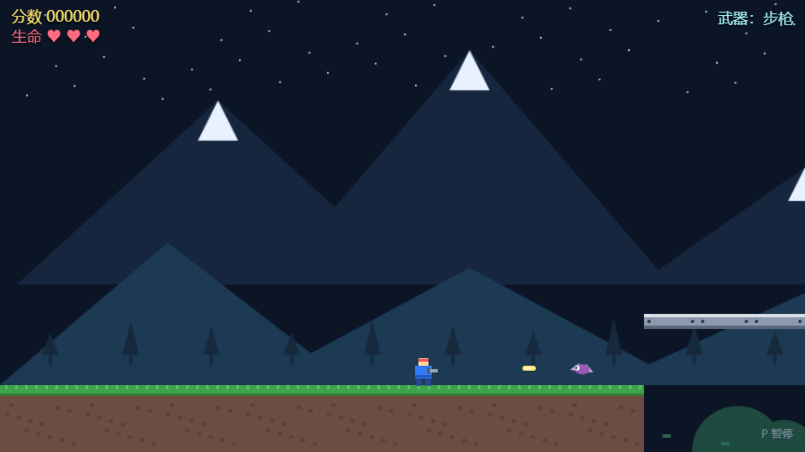
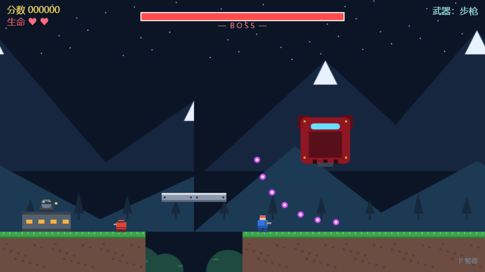

# 合金突击 · METAL ASSAULT

一个用 **Phaser 3** 制作的魂斗罗风格横版平台射击游戏。单个 `index.html` 文件、零构建、零外部资源 —— **双击即玩**。



| 游戏实战 | Boss 战 |
| :---: | :---: |
|  |  |

> 运行需要联网加载 Phaser（cdnjs CDN）；所有画面由 `Graphics.generateTexture()` 程序化生成，音效由 Web Audio API 实时合成。

## 快速开始

任选其一：

1. **双击即玩**：直接双击 `index.html` 用浏览器打开（需联网）。
2. **本地服务器**（推荐，最高分记录可正常保存）：
   ```bash
   python -m http.server 8090   # 在项目目录下执行，然后访问 http://127.0.0.1:8090
   ```
3. **克隆仓库**：
   ```bash
   git clone https://gitee.com/lilhand/snake-game.git
   ```

## 玩法

- **移动**：`A / D` 或 `← / →`
- **跳跃**：`W / ↑ / 空格`（按住跳更高，支持 coyote time 与跳跃预输入）
- **射击**：`J` 或 鼠标左键（可长按连发）
- **暂停**：`P` 或 `Esc`
- **武器**：初始步枪 → 拾取 **S**（三向散弹）/ **M**（速射机枪）；中弹掉回步枪
- **生命**：3 条命，受击后 2 秒无敌闪烁，死亡从最近检查点复活

## 关卡与敌人

横向卷轴关卡约 5 屏长，含沟壑跳跃、单向悬浮平台、2 个检查点，尽头是两阶段 Boss（扇形弹幕 + 血量过半后追加蓄力冲撞）。

| 敌人 | 行为 |
| --- | --- |
| 步兵 | 平台上来回巡逻，接触伤害 |
| 炮台 | 固定，周期性朝玩家开火 |
| 飞行者 | 正弦轨迹飞行，追踪玩家方位 |
| Boss | 40 血，扇形弹幕；过半血进入狂暴（冲撞 + 密集弹幕） |

## 修改与扩展

所有可调参数集中在 `index.html` 顶部的 **CONFIG** 对象（重力、移速、射速、敌人血量、Boss 阶段、检查点等），关卡地形与敌人摆放是数据表驱动的 **LEVEL** 对象，改数据即可加怪、改地形，无需动逻辑代码。

## 技术

- Phaser 3.90.0（Arcade Physics，对象池子弹，分组碰撞矩阵）
- 程序化纹理生成（Boot 场景统一生成）
- Web Audio API 合成音效（射击 / 爆炸 / 受击 / 拾取 / 检查点）
- 场景：Boot → Menu → Game → Pause / GameOver / Win

## 更新日志

### v1.1（2026-09）

- **修复卡死**：Phaser 3.87 起组与单精灵的碰撞回调实参顺序会翻转，原写法取反参后抛异常并终止主循环（表现为碰怪 / 碰武器道具 / 中弹时游戏卡死）。现全部回调按对象身份识别参数。
- **修复瞬移**：物理组默认值会在入组时重开重力，导致飞行怪坠地、武器道具加速下坠穿地板。现入组后重新关闭重力。
- 补充 README、游戏截图与开源许可证。

### v1.0

- 首个版本：完整关卡、三种敌人、两阶段 Boss、三种武器、检查点复活、本地最高分记录。

## 开源许可

[MIT](LICENSE) © lilhand

---
Made with Phaser 3 · 署名 lilhand
